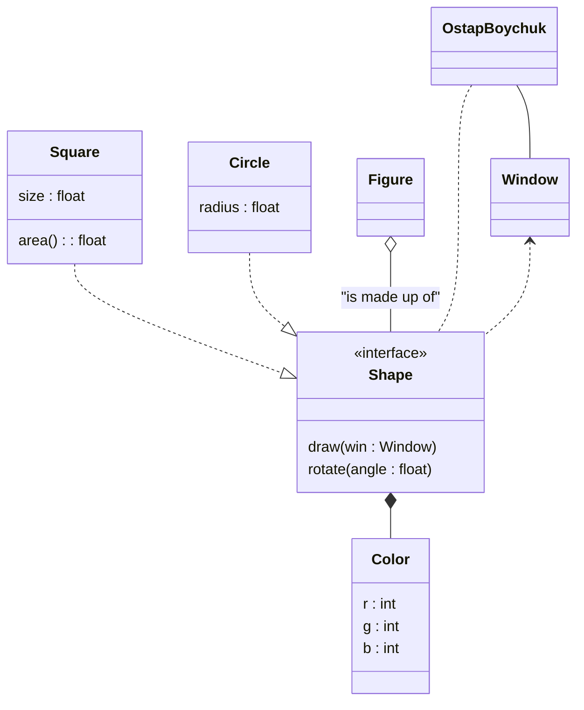

```mermaid
classDiagram

class Square {
    size : float
    area() : float
}

class Circle {
    radius : float
}

class Figure

class OstapBoychuk

class Window

class Color {
    r : int
    g : int
    b : int
}

class Shape {
    <<interface>>
    draw(win : Window)
    rotate(angle : float)
}

Square ..|> Shape
Circle ..|> Shape
Figure o-- Shape : "is made up of"
Shape *-- Color
OstapBoychuk -- Window
OstapBoychuk .. Shape
Window <.. Shape

```
